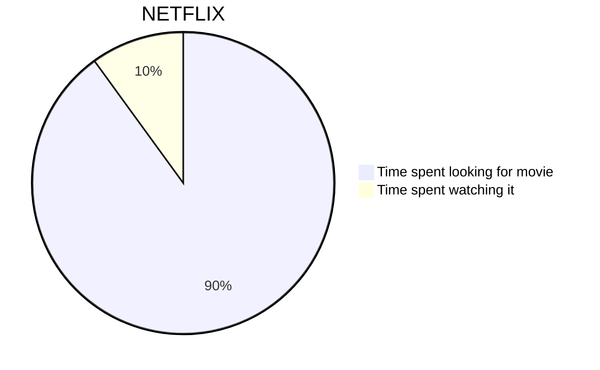

# PrismaDB

## DIAGRAMA CON MERMAID EN COSNTRIUCCIÓN

## GLOSARIO

- Npm es una herramienta que se usa para instalar paquetes.

- Npx es una herramienta que se usa para ejecutar paquetes.

[Documentación de prisma](https://www.prisma.io/docs/concepts/components/prisma-schema)
